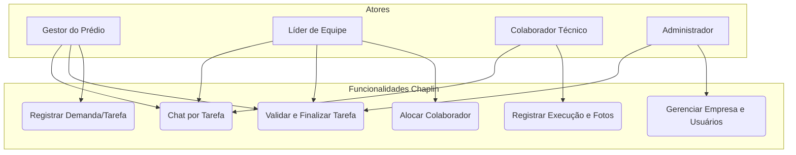
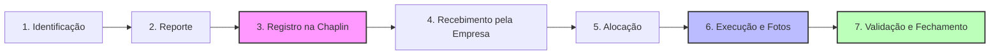
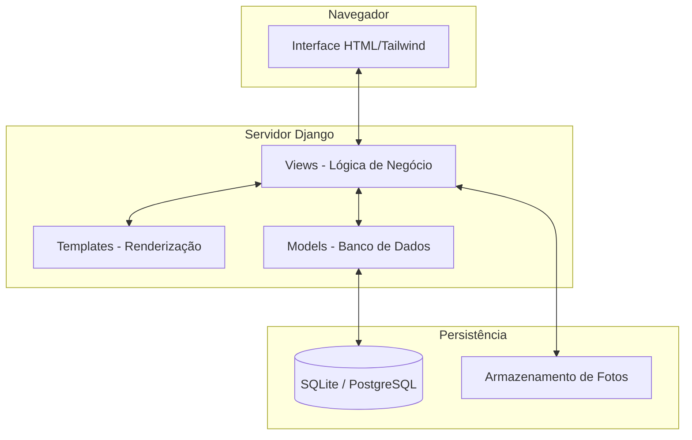
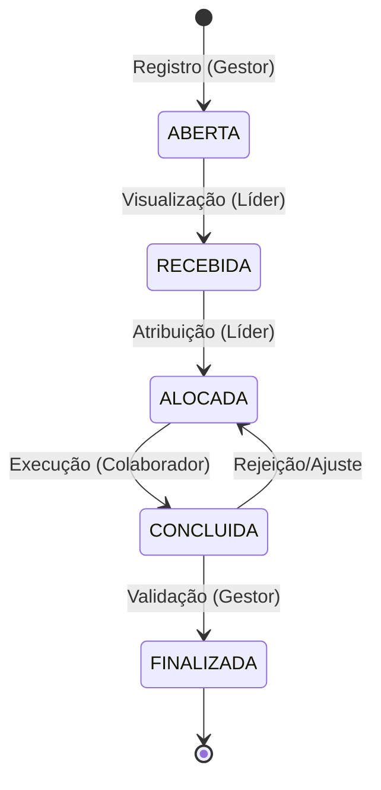

# Diagramas do Sistema - Chaplin

Este documento apresenta a modelagem visual do Chaplin, facilitando o entendimento dos processos e da estrutura técnica.

## 1. Diagrama de Casos de Uso

Este diagrama ilustra como os diferentes atores interagem com as funcionalidades principais do sistema.

---

## 2. Fluxo Operacional (As 7 Etapas)

O caminho que uma tarefa percorre desde a identificação do problema até o fechamento.

---

## 3. Arquitetura do Sistema (MTV)

Como o framework Django organiza os dados e a interface.

---

## 4. Diagrama de Estados da Tarefa

Os status que uma tarefa pode assumir durante seu ciclo de vida.

