# 📊 Diagramas - Chaplin

## 1️⃣ Diagrama de Caso de Uso

```mermaid
graph TB
    Cliente["👤 Cliente"]
    Profissional["👷 Profissional"]
    Admin["👨‍💼 Admin"]
    Sistema["🖥️ Sistema"]

    Cliente -->|Cadastrar| Autenticacao["Autenticação"]
    Profissional -->|Cadastrar| Autenticacao
    Admin -->|Cadastrar| Autenticacao
    
    Cliente -->|Publicar Tarefa| PublicarTarefa["Publicar Tarefa"]
    Profissional -->|Visualizar Tarefas| BuscaTarefas["Buscar Tarefas"]
    Profissional -->|Fazer Proposta| FazerProposta["Fazer Proposta"]
    
    Cliente -->|Visualizar Propostas| VisualizarPropostas["Visualizar Propostas"]
    Cliente -->|Aceitar Proposta| AceitarProposta["Aceitar Proposta"]
    
    Cliente -->|Chat| Chat["Chat em Tempo Real"]
    Profissional -->|Chat| Chat
    
    Cliente -->|Pagar| Pagamento["Processar Pagamento"]
    Sistema -->|Transferir| Pagamento
    
    Cliente -->|Avaliar| Avaliacao["Avaliar Profissional"]
    Profissional -->|Avaliar| Avaliacao
    
    Admin -->|Gerenciar| GerenciarUsuarios["Gerenciar Usuários"]
    Admin -->|Resolver| Disputas["Resolver Disputas"]
    Admin -->|Visualizar| Relatorios["Relatórios"]
    
    Sistema -->|Notificar| Notificacoes["Notificações"]
    
    style Cliente fill:#e1f5ff
    style Profissional fill:#f3e5f5
    style Admin fill:#fff3e0
    style Sistema fill:#e8f5e9
```

---

## 2️⃣ Diagrama de Fluxo - Publicar Tarefa

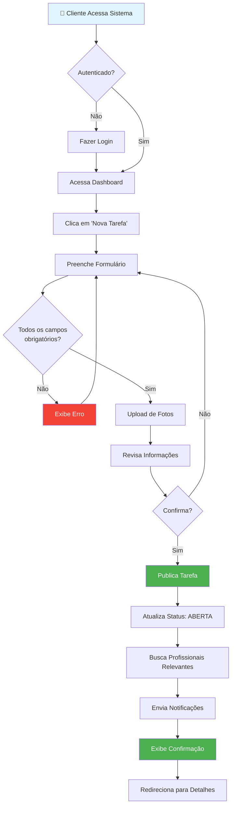

---

## 3️⃣ Diagrama de Fluxo - Fazer Proposta

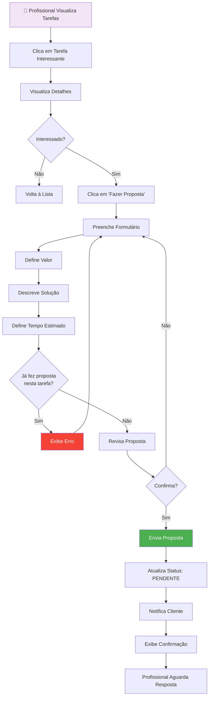

---

## 4️⃣ Diagrama de Fluxo - Aceitar Proposta e Pagar

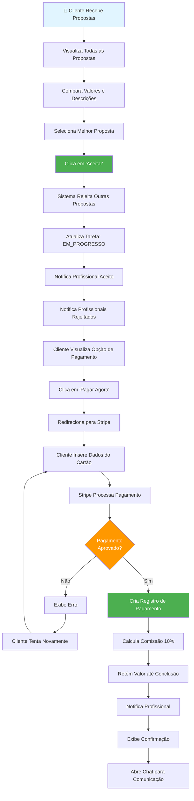

---

## 5️⃣ Diagrama de Fluxo - Chat em Tempo Real

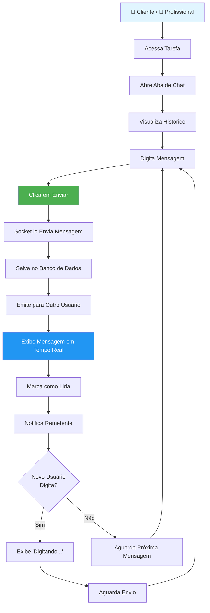

---

## 6️⃣ Diagrama de Fluxo - Conclusão e Avaliação

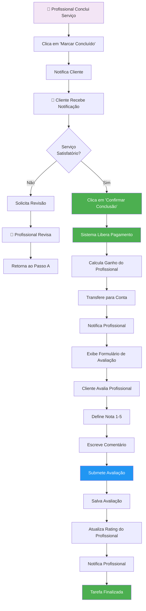

---

## 7️⃣ Diagrama de Fluxo - Busca e Filtragem

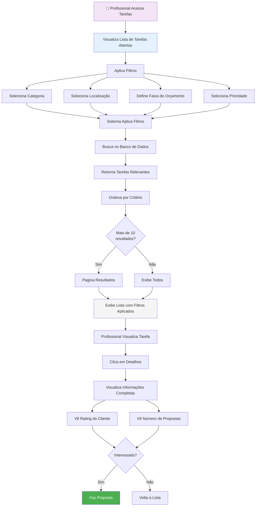

---

## 8️⃣ Diagrama de Fluxo - Administração

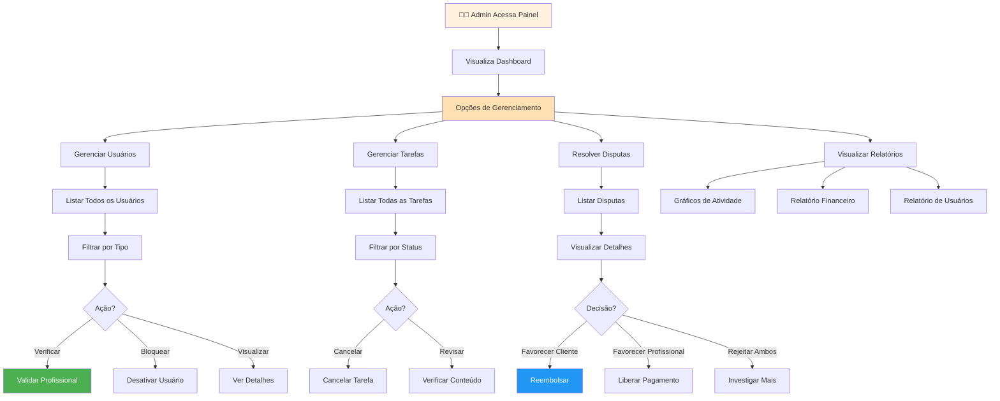

---

## 9️⃣ Diagrama de Arquitetura do Sistema

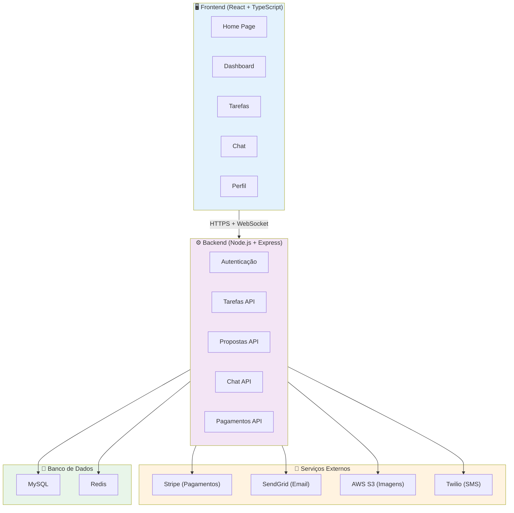

---

## 🔟 Diagrama de Sequência - Fluxo Completo de Tarefa

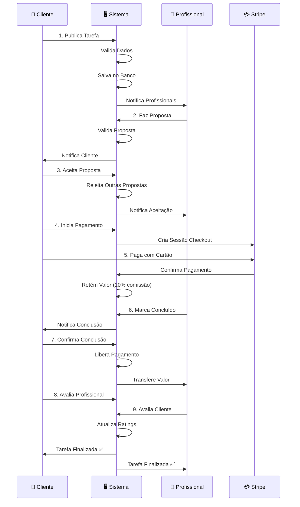

---

## 1️⃣1️⃣ Diagrama de Estados - Tarefa

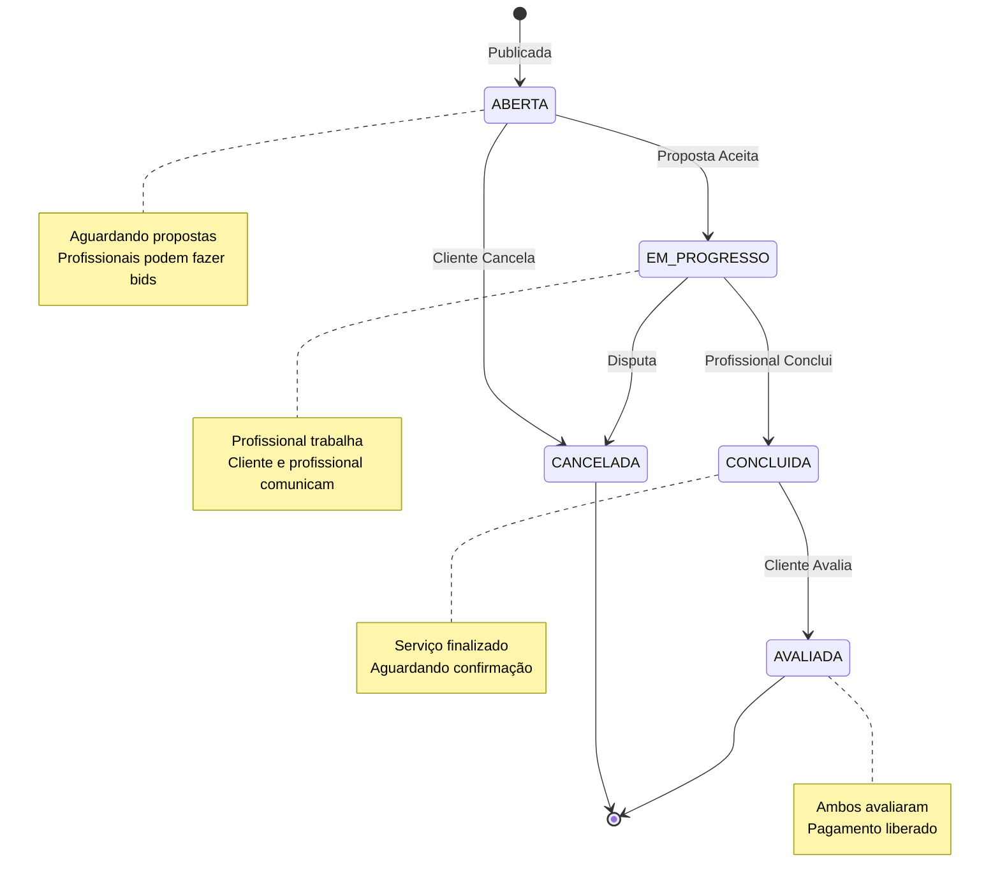

---

## 1️⃣2️⃣ Diagrama de Estados - Proposta

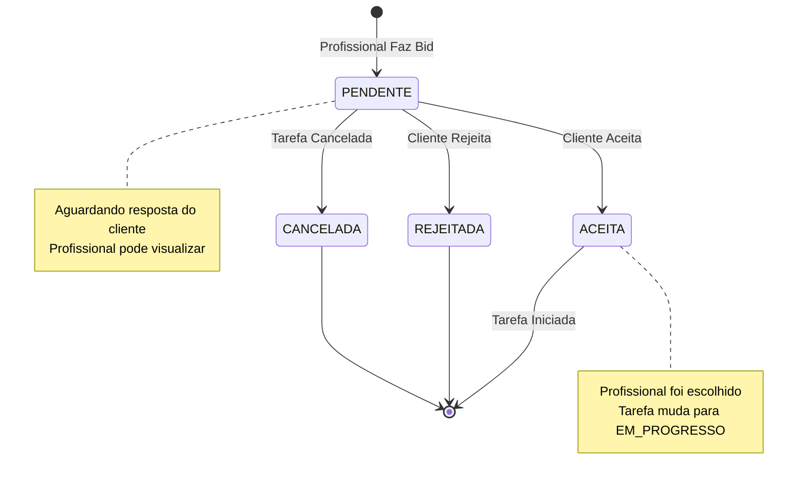

---

## 1️⃣3️⃣ Diagrama de Componentes

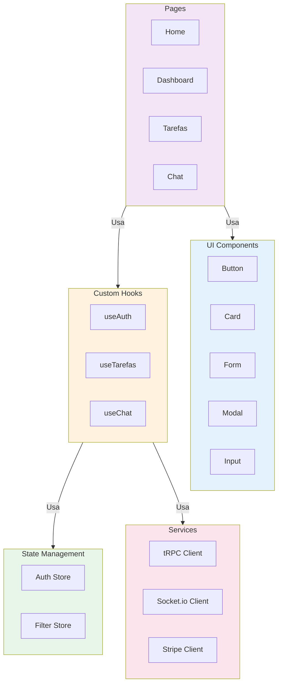

---

Esses diagramas cobrem:
- ✅ Caso de uso completo
- ✅ Fluxos principais do sistema
- ✅ Arquitetura geral
- ✅ Sequência de operações
- ✅ Estados das entidades
- ✅ Componentes do sistema

Quer que eu gere os slides agora com todos esses diagramas?
